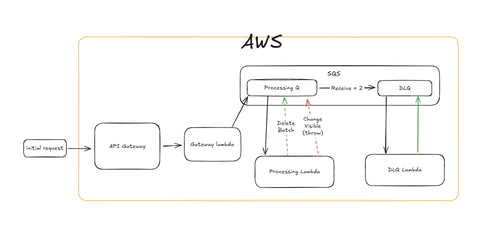

## **Resources Overview**
This serverless architecture is built using AWS services, primarily API Gateway, Lambda, and SQS, to ensure scalability, fault tolerance, and event-driven processing.

#### 1. API Gateway
Serves as the entry point for incoming client requests, routing them to the initial processing Lambda.

#### 2. Task-Gateway (Gateway Lambda Function)
This function processes incoming requests, validates the payload, and enqueues messages into an SQS Processing Queue for asynchronous handling.

#### 3. Task-Processing (Processing Lambda Function)
Consumes messages from SQS Processing Queue, performs business logic, and determines whether processing is successful or if a retry is required.

#### 4. Processing Queue (SQS)
Acts as a decoupling mechanism between the API Gateway and Task-Processing. Messages are processed asynchronously by a dedicated Lambda (Task-Processing).

#### 5. Dead Letter Queue (DLQ SQS)
Captures messages that fail processing after multiple retries, preventing message loss.

#### 6. DLQ Lambda (DLQ Lambda Function)
Monitors and processes failed messages in the DLQ, ensuring proper handling, logging, and cleanup.

## **Main Flow Overview**

#### Message Ingestion:
API Gateway receives an HTTP request and invokes the Gateway Lambda.

The Gateway Lambda processes the request and pushes it into the Processing Queue (SQS) for asynchronous processing.

#### Message Processing & Error Handling:
The Processing Lambda pulls messages in batches from Processing Queue (SQS).

If processing succeeds, the Lambda manually deletes the processed batch from SQS.

If processing fails for any message in the batch:
 - The function extends the visibility timeout of each message by multiplying the retry count on current queue visibility timeout of SQS to allow retries with increase timeout for each.
 - The function throws an error to ensure reprocessing.

Processing Queue (SQS) allows up to 2 maximum receive attempts before moving messages to the Dead Letter Queue (DLQ SQS).

#### Dead Letter Queue Handling:

Messages that exceed the retry limit in the SQS Processing Queue are pushed to DLQ SQS.

DLQ Lambda is triggered to process these failed messages.

After handling, DLQ Lambda deletes the batch from DLQ SQS to ensure clean-up and prevent further retries.

## Deployment
This project is built using the Serverless Framework to deploy AWS Lambda functions, API Gateway, and SQS. Follow the steps below to deploy the application successfully.

#### Prerequisites
Ensure you have the following installed:
- Node.js (Latest LTS version recommended)
- Serverless Framework (npm install -g serverless)
- AWS CLI (Configured with the necessary IAM permissions)

#### Deployment steps:
- Install dependencies `npm install`
- Deploy to AWS `serverless deploy`
- Verify deployment
`curl -x POST https://URL/api/v1/tasks -d '{"taskId":1,"payload":{"someProperty":"test"}}'`